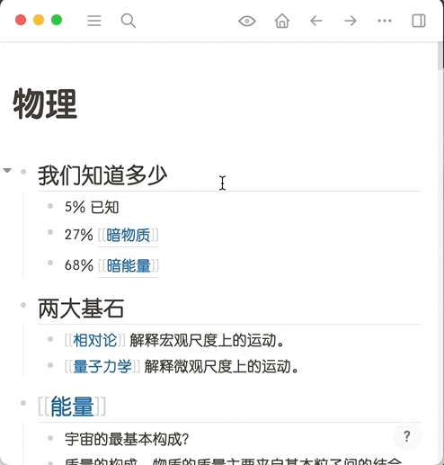
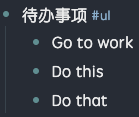

# logseq-plugin-doc

将页面已更加文章化的形式展示，并提供快速导出功能。

Show page in a more document like look and provide quick exporting.

## 使用展示 (Usage)

### 与 TOC Generator 联动 (Inline TOC Generator Support)

页面内嵌入的 TOC 在导出时链接仍然可用并且每个被链接的块上会有返回的箭头。

通过导出 HTML 打印出的 PDF 会保留这些链接。

When exported, links of the inline TOCs will remain usable and all blocks being referenced will also feature an arrow that can go back.

The PDF printed out by using the exported HTML will retain these links.

## 快捷键 (Shortcuts)

通过命令栏可以找到切换文档视图的命令，它的快捷键为 macOS 下 `cmd+shift+d` 或者 Windows 下 `ctrl+shift+d`。

You can toggle the document view with the command palette，It's shortcut key is `cmd+shift+d` on macOS, `ctrl+shift+d` on Windows.

## 关于列表 (About lists)

你可以在无序列表的块上加`#.ul`标签，这样插件就知道这是一个无序列表并配合排版了。你也可以加`#.ul-nested`标签，如果你需要多级无序列表的话。

同样，有序列表可以加`#.ol`或者`#.ol-nested`等 [Ordered Lists 插件](https://github.com/sethyuan/logseq-plugin-ol) 支持的标签。

You can add a `#.ul` tag to a block that is a bullet list, in this way, the plugin will know to format it accordingly. You can also use `#.ul-nested` if it's a nested bullet list what you want.

Similarly, you can use tags that [Ordered Lists plugin](https://github.com/sethyuan/logseq-plugin-ol) can support like `#.ol` or `#.ol-nested` to indicate an ordered list.

示例 (Example)

## Logseq 新版本中的 Linked References (Linked References in newer versions of Logseq)

新版本中 Linked References 区域是动态加载的，如果你想要在导出中看到这块的内容的话你需要将页面滚动到这部分，确保这个区域内的所有数据都是被渲染了的。

Linked References are dynamically loaded in newer versions of Logseq, be sure to scroll to this part of the page and all its content is loaded and displayed if you want to have this section exported.
