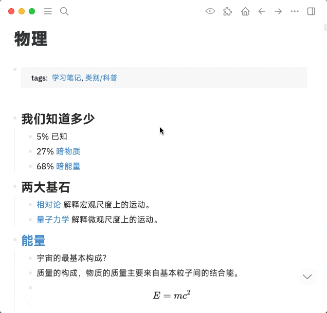

中文 | [English](README.en.md)

# logseq-plugin-doc

将页面已更加文章化的形式展示，并提供快速导出功能。

## 使用展示

https://user-images.githubusercontent.com/3410293/211442242-129978a6-b7a6-41d2-b830-296c814e36e2.mp4

### 与 TOC Generator 联动

页面内嵌入的 TOC 在导出时链接仍然可用并且每个被链接的块上会有返回的箭头。

通过导出 HTML 打印出的 PDF 会保留这些链接。

## 快捷键

通过命令栏可以找到切换文档视图的命令，它的快捷键为 macOS 下 `cmd+shift+d` 或者 Windows 下 `ctrl+shift+d`。

## 关于列表

你可以在无序列表的块上加`#.ul`标签，这样插件就知道这是一个无序列表并配合排版了。你也可以加`#.ul-nested`标签，如果你需要多级无序列表的话。

同样，有序列表可以加`#.ol`或者`#.ol-nested`等 [Ordered Lists 插件](https://github.com/sethyuan/logseq-plugin-ol) 支持的标签。

示例

## Logseq 新版本中的 Linked References

新版本中 Linked References 区域是动态加载的，如果你想要在导出中看到这块的内容的话你需要将页面滚动到这部分，确保这个区域内的所有数据都是被渲染了的。

## 复杂主题的导出

针对一些实现较复杂的主题，有必要在插件配置中设置一下 `pluginsDir`，否则导出的 HTML 会加载不到样式资源。
